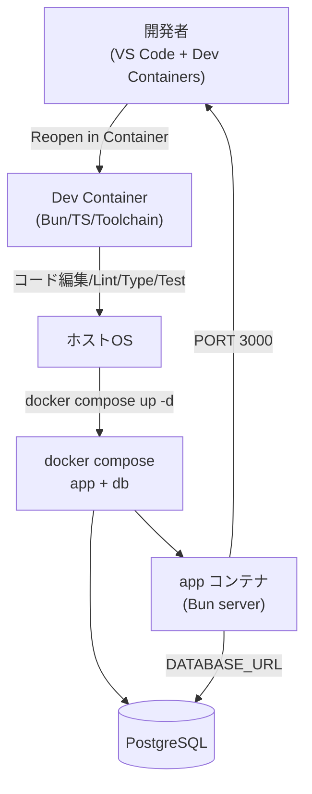
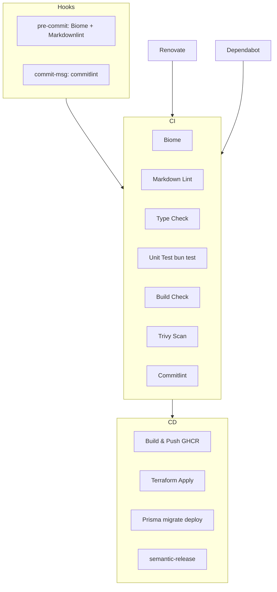
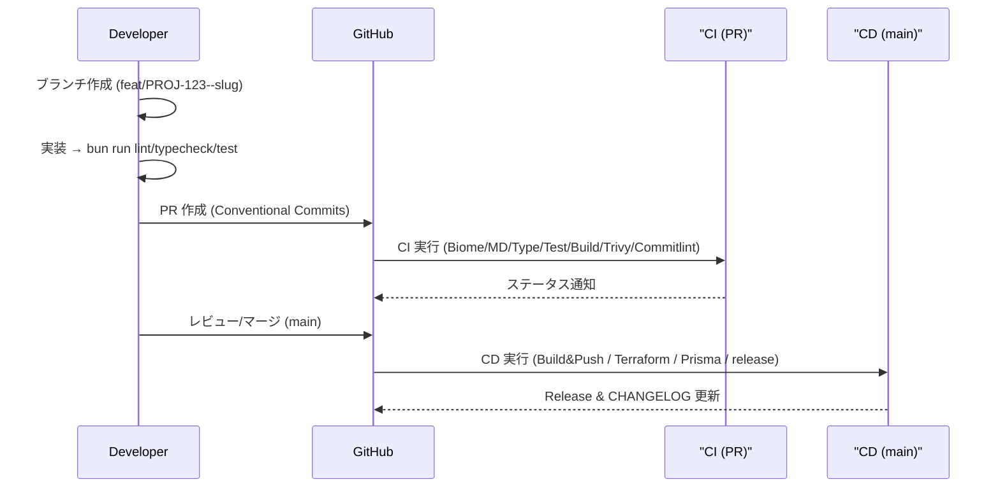
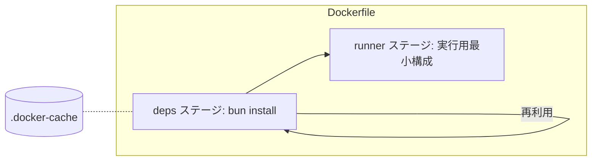
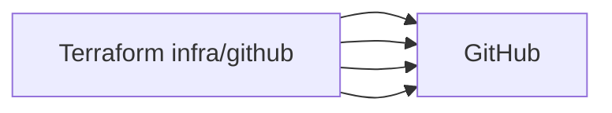

# 設計ドキュメント

本プロジェクトのアーキテクチャ、開発フロー、CI/CD、リポジトリ自動化の設計方針を示します。

## 全体アーキテクチャ



- 開発は Dev Container 上で統一（Bun/TypeScript/ツール群）。
- Docker デーモン操作はホストで実行（compose で DB と app を起動）。
- アプリは `http://localhost:3000`、ヘルスチェックは `/healthz`。

## リポジトリ自動化



- Conventional Commits 準拠（commitlint）。
- semantic-release により GitHub Release と `CHANGELOG.md` を自動更新。
- Renovate/Dependabot による依存更新 PR を想定。

## 開発フロー（シーケンス）



## コンテナ/ビルド設計



- 依存インストールを分離し、レイヤキャッシュを最大化。
- Compose で BuildKit のローカルキャッシュ（`.docker-cache`）を利用。
- Bun 1.2 以降は `bun.lock` を使用。
- GHCR へのタグは Actions 側で `owner/repo` を小文字化して生成（Docker の命名規則に準拠）。

## インフラ/IaC（GitHub 設定）



- `infra/github` でブランチ保護/コラボレーター/Secrets/Variables 等を自動化。
- 実行には `GITHUB_TOKEN` (repo 管理権限) が必要。

## ディレクトリ要点

```text
web-template/
├── .ai-prompts/
│   └── prompts.md
├── .devcontainer/
│   ├── devcontainer.json
│   └── Dockerfile
├── .github/
│   ├── PULL_REQUEST_TEMPLATE.md
│   ├── workflows/
│   │   ├── ci.yml
│   │   └── cd.yml
│   ├── dependabot.yml
│   └── renovate.json
├── .husky/
│   ├── commit-msg
│   ├── pre-commit
│   └── pre-push
├── .vscode/
│   ├── extensions.json
│   └── settings.json
├── docker/
│   └── Dockerfile
├── infra/
│   ├── environments/
│   │   ├── prd/
│   │   │   └── main.tf
│   │   └── stg/
│   │       └── main.tf
│   ├── github/
│   │   ├── main.tf
│   │   ├── variables.tf
│   │   └── README.md
│   └── modules/
│       └── README.md
├── prisma/
│   ├── migrations/
│   │   └── .gitkeep
│   └── schema.prisma
├── tools/
│   ├── branch.ts
│   └── quick-commit.ts
├── src/
│   ├── backend/
│   │   └── server.ts
│   ├── components/
│   │   └── README.md
│   ├── frontend/
│   │   └── app/
│   │       └── page.tsx
│   └── lib/
│       ├── hello.ts
│       └── hello.test.ts
├── .commitlintrc.json
├── .czrc
├── .dockerignore
├── .gitignore
├── .releaserc.json
├── biome.json
├── bun.lock
├── CHANGELOG.md
├── DESIGN.md
├── docker-compose.yml
├── package.json
├── PREREQUISITE.md
├── README.md
└── tsconfig.json
```

## 非機能要件/運用

- コード規約: Biome（formatter/linter）
- コミット規約: Conventional Commits（commitlint）
- 依存更新: Renovate/Dependabot
- リリース: semantic-release（GitHub Release + CHANGELOG.md）

## 技術スタック定義

### 既定の技術スタック（固定）

#### ランタイム・言語

- **Bun**: 高速な JavaScript/TypeScript ランタイム
- **TypeScript**: 静的型付け言語
- **Node.js**: 必要に応じて Bun と併用可能

#### 開発環境・ツール

- **Dev Containers**: 統一された開発環境
- **VS Code**: 推奨エディタ（拡張機能設定済み）
- **Git**: バージョン管理
- **GitHub**: リポジトリ・CI/CD プラットフォーム

#### コード品質・規約

- **Biome**: フォーマッタ・リンター
- **Husky**: Git フック管理
- **commitlint**: Conventional Commits 準拠
- **semantic-release**: 自動バージョニング・リリース

#### インフラ・CI/CD

- **Docker**: コンテナ化
- **Terraform**: インフラ・GitHub 設定の IaC
- **GitHub Actions**: CI/CD パイプライン
- **Dependabot/Renovate**: 依存関係自動更新

### 柔軟性のある技術スタック（選択可能）

#### フロントエンドフレームワーク

- **React**: デフォルト（設定済み）
- **Vue**: 必要に応じて導入可能
- **Svelte**: 必要に応じて導入可能
- **その他**: 任意のフレームワークに対応

#### データベース・ORM

- **PostgreSQL**: デフォルト（設定済み）
- **Prisma**: デフォルト ORM
- **その他**: MySQL, SQLite, MongoDB 等に変更可能
- **ORM**: Prisma 以外（TypeORM, Drizzle 等）も選択可能

#### スタイリング

- **Tailwind CSS**: デフォルト（設定済み）
- **その他**: CSS Modules, Styled Components, Emotion 等

#### テストフレームワーク

- **bun test**: デフォルト（Vitest 互換）
- **その他**: Jest, Vitest 等も利用可能

### 未決定・範囲外の技術・スコープ

#### フロントエンド（未決定）

- **UI ライブラリ**: Material-UI, Chakra UI, Ant Design 等
- **状態管理**: Redux, Zustand, Jotai, Zustand 等
- **ルーティング**: React Router, Next.js, Remix 等
- **SSR/SSG**: Next.js, Nuxt, SvelteKit 等

#### バックエンド（未決定）

- **API フレームワーク**: Express, Fastify, Hono 等
- **認証**: JWT, Session, OAuth 等
- **バリデーション**: Zod（基本設定済み）, Joi, Yup 等

#### インフラ・デプロイ（未決定）

- **クラウドプロバイダー**: AWS, GCP, Azure 等
- **コンテナオーケストレーション**: Kubernetes, Docker Swarm 等
- **CDN**: Cloudflare, AWS CloudFront 等
- **監視・ログ**: Prometheus, Grafana, ELK Stack 等

#### その他（範囲外）

- **モバイルアプリ**: React Native, Flutter 等
- **デスクトップアプリ**: Electron, Tauri 等
- **AI/ML**: TensorFlow, PyTorch 等
- **ブロックチェーン**: Web3, Ethereum 等

### 技術選択の指針

1. **既定技術**: プロジェクトの基盤として固定、変更不可
2. **柔軟技術**: チームの要件・好みに応じて選択可能
3. **未決定技術**: プロジェクト開始時にチームで決定
4. **範囲外**: 本テンプレートの対象外、別途検討が必要

この設計により、基盤は統一しつつ、フロントエンド・バックエンドの技術選択に柔軟性を持たせています。

### 注意事項（開発環境の前提）

- Dev Container は統一開発環境の提供を目的として使用し、Docker デーモン操作（`docker compose` など）は原則ホスト側で実行します。
- 本番イメージのビルドは CI（GitHub Actions）で行い、ローカルでは DB 起動用途に限定します。
