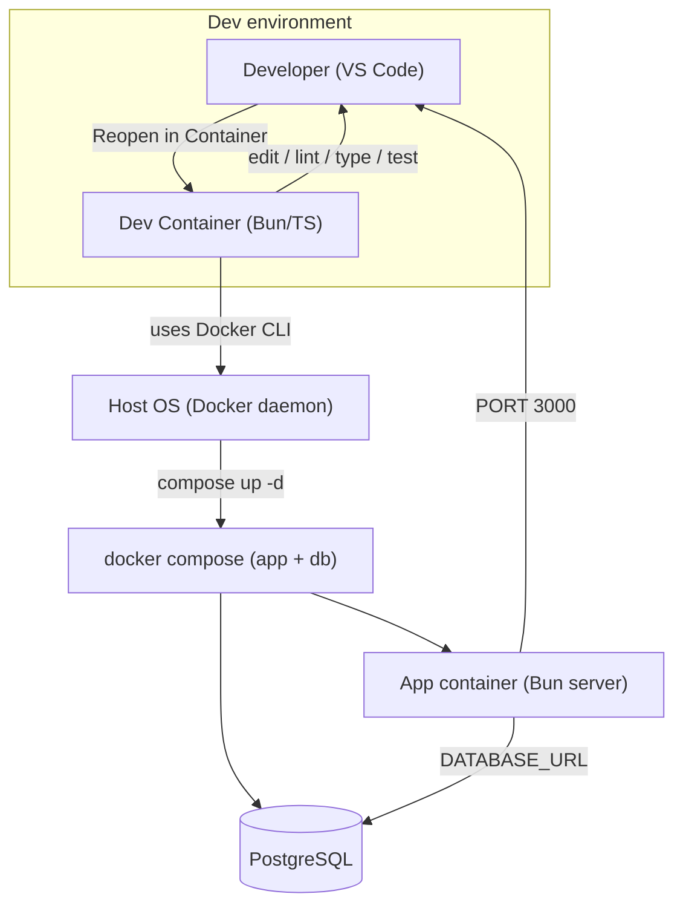
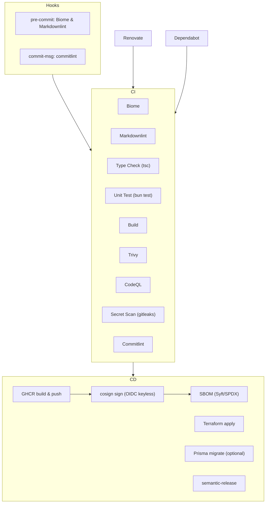
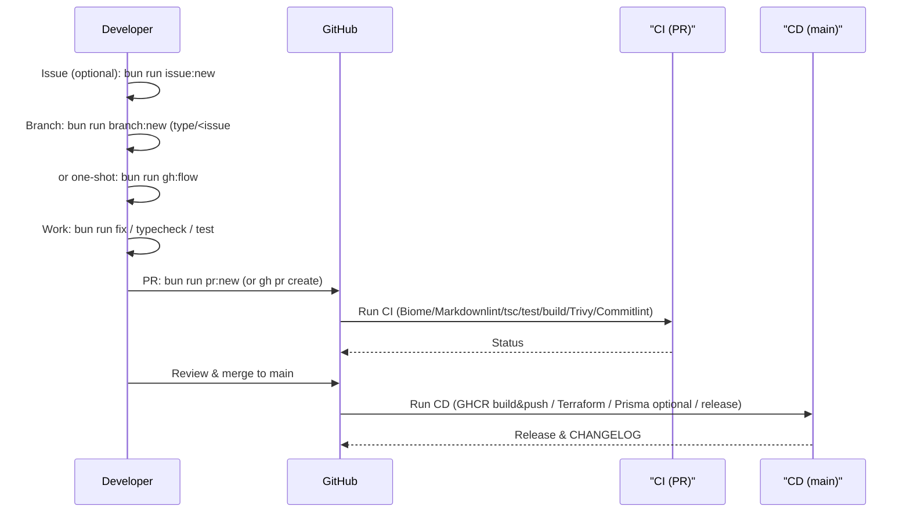
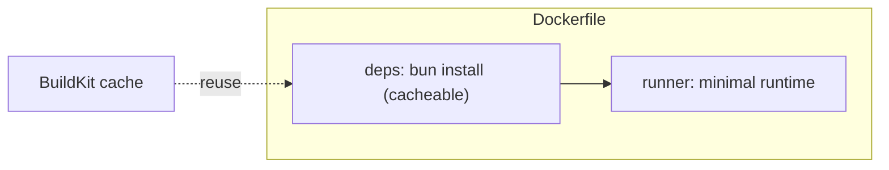
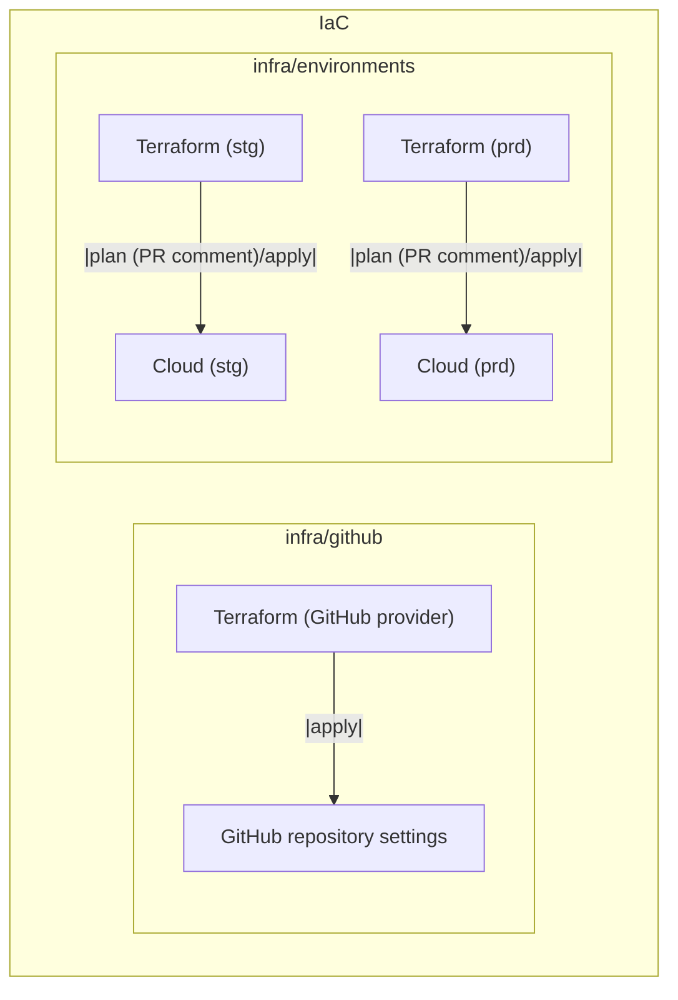

# Design

本プロジェクトの Architecture、Development workflow、CI/CD、Repository automation の設計方針を示します。

## Architecture (overview)



- Dev Containers を前提に統一した開発環境（Bun/TypeScript/Tooling）。
- Docker daemon 操作は Host 側で実行し、docker compose で app/db を起動。
- App: `http://localhost:3000`（health check: `/healthz`）。
- DB 接続は `DATABASE_URL` を使用。

## Repository automation



- Commit convention: Conventional Commits（commitlint）
- Release: semantic-release（GitHub Release と `CHANGELOG.md` を自動更新）
- Dependency updates: Renovate / Dependabot が PR を作成し CI をトリガー
- Security: CodeQL（codeql.yml）、gitleaks（secret-scan.yml）

## Development workflow (sequence)



## Container / Build design



- Goals: small image, fast rebuilds, deterministic output
- Layers: `deps` (bun install) → `runner`（必要ファイルのみコピー）
- Caching: BuildKit cache と bun の cache mount を活用
- Lockfile: Bun 1.2+ は `bun.lock` を利用
- Local dev: docker compose は DB 用のみに使用（app は Bun サーバをローカル起動）
- CI build & push: `.github/workflows/cd.yml` で BuildKit + `docker/build-push-action@v6`
  - GHCR tag は Actions で `github.repository` を lowercase 化して付与（Docker 命名規則準拠）

## Infrastructure / IaC (GitHub settings)



- `infra/github` でブランチ保護/コラボレーター/Secrets/Variables 等を自動化。
- 実行には `GITHUB_TOKEN` (repo 管理権限) が必要。

## Directory overview

```text
web-template/
├── .devcontainer/          Dev Containers config
├── .github/
│   ├── workflows/          CI/CD workflows (ci.yml, cd.yml)
│   ├── dependabot.yml      Dependency updates
│   └── renovate.json
├── docker/
│   └── Dockerfile          Production image
├── infra/
│   ├── environments/       Cloud IaC per env (stg, prd)
│   │   ├── stg/main.tf
│   │   └── prd/main.tf
│   └── github/             Repo settings IaC (branch protection, secrets)
├── prisma/
│   └── schema.prisma       DB schema
├── tools/                  CLI tools for workflow
│   ├── branch.ts           Create branch (type/<issue#>--<slug>)
│   ├── issue.ts            Create issue (gh)
│   ├── pr.ts               Create PR (gh)
│   ├── gh-flow.ts          Issue→Branch→PR helper (gh)
│   ├── quick-commit.ts     Quick Conventional Commit
│   └── fix.ts              Lint/type/test auto-fix run
├── src/
│   ├── backend/server.ts   Bun server (port 3000, /healthz)
│   ├── frontend/app/page.tsx
│   └── lib/                Sample lib & tests
├── docker-compose.yml      Local DB (dev)
├── package.json            Scripts & deps
├── README.md               Overview & workflow
├── PREREQUISITE.md         Setup guide
└── DESIGN.md               Design & architecture
```

## Non-functional & operations

- Code style: Biome (formatter/linter)
- Commit convention: Conventional Commits (commitlint)
- Dependencies: Renovate / Dependabot
- Release: semantic-release (GitHub Release + CHANGELOG.md)

## Stack definition

### Core stack (fixed)

#### Runtime & language

- **Bun**: JavaScript/TypeScript runtime
- **TypeScript**: Static type system
- **Node.js**: Use with Bun if needed

#### Tooling

- **Dev Containers**: Unified dev environment
- **VS Code**: Recommended editor
- **Git**: Version control
- **GitHub**: Repo & CI/CD platform

#### Quality & conventions

- **Biome**: Formatter/Linter
- **Husky**: Git hooks
- **commitlint**: Conventional Commits
- **semantic-release**: Automated release/versioning

#### Infrastructure & CI/CD

- **Docker**: Containerization
- **Terraform**: IaC (including GitHub settings)
- **GitHub Actions**: CI/CD pipeline
- **Dependabot/Renovate**: Dependency updates

### Optional stack

#### Front-end framework

- **React** (default), **Vue**, **Svelte**, others

#### Database / ORM

- **PostgreSQL** (default)
- **Prisma** (default ORM)
- Others: MySQL, SQLite, MongoDB, etc.
- Alternative ORM: TypeORM, Drizzle, etc.

#### Styling

- **Tailwind CSS** (default), CSS Modules, Styled Components, Emotion, etc.

#### Test framework

- **bun test** (Vitest-compatible), Jest, Vitest

### TBD / Out of scope

#### Front-end (TBD)

- UI library, State management, Routing, SSR/SSG

#### Back-end (TBD)

- API framework, Auth, Validation

#### Infrastructure / Deploy (TBD)

- Cloud provider, Orchestration, CDN, Observability

#### Others (out of scope)

- Mobile app (React Native, Flutter), Desktop app (Electron, Tauri),
  AI/ML (TensorFlow, PyTorch), Blockchain (Web3, Ethereum)

### Selection policy

1. **Core**: 固定（プロジェクトの基盤）
2. **Optional**: チーム要件に応じて選択
3. **TBD**: プロジェクト開始時に決定
4. **Out of scope**: テンプレート対象外

この設計により、基盤は統一しつつ、フロントエンド・バックエンドの技術選択に柔軟性を持たせています。

### Notes (dev environment)

- Dev Containers を前提とし、`docker compose` などのデーモン操作はホストで実行します。
- Production image build は GitHub Actions 上で行い、ローカルは DB 起動用途に限定します。
